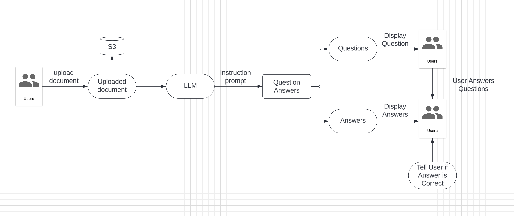

# Personal Learning Assistant

## Overview

The Personal Learning Assistant is an innovative application designed to enhance the learning experience by providing personalized assistance, generating questions from documents, and offering feedback based on user responses. Whether you're a student, educator, or lifelong learner, our assistant is here to support your learning journey.

## Features

- **Document Upload**: Users can upload documents containing study materials, lecture notes, or textbooks to the application.
- **Question Generation**: The assistant automatically generates questions from the uploaded documents, helping users test their understanding of the material.
- **Feedback System**: Users receive immediate feedback on their responses to the generated questions, enabling them to identify areas for improvement and reinforce their learning.
- **Learning Progress Tracking**: The application tracks users' learning progress over time, allowing them to monitor their performance and set learning goals.
- **Customizable Settings**: Users can customize their learning experience by adjusting settings such as question difficulty level, feedback frequency, and study schedule.

## Technologies

- **Frontend**: The frontend of the application is built with Streamlit.
- **Backend**: The backend is powered by FastAPI, MongoDB, and Flask-CORS, providing robust data storage, retrieval, and processing capabilities.
- **Machine Learning**: The application utilizes machine learning libraries such as TensorFlow and Keras for natural language processing (NLP) tasks, including question generation and feedback analysis.
- **Deployment & DevOps**: Docker and AWS (Amazon Web Services) are used for containerization and cloud deployment, with GitHub Actions for continuous integration and deployment (CI/CD) pipelines.

## System Design 

## Usage

Once the application is running, users can:

- Upload documents containing study materials.
- Generate questions from the uploaded documents and answer them.
- Receive immediate feedback on their responses and track their learning progress.
- Customize settings to tailor their learning experience.

## API Documentation

For detailed documentation on the API endpoints and functionalities, refer to the [API Documentation](link-to-api-docs).

## Contributing

Contributions to the Personal Learning Assistant project are welcome! To contribute, please follow these guidelines:

1. Fork the repository and create a new branch for your feature or bug fix.
2. Make your changes and ensure all tests pass.
3. Submit a pull request with a clear description of your changes and why they are necessary.
4. Participate in code reviews and address any feedback or comments from the maintainers.

## License

The Personal Learning Assistant is licensed under the [MIT License](link-to-license). See the [LICENSE](link-to-license-file) file for details.

## Credits

Special thanks to the following individuals and organizations for their contributions to the Personal Learning Assistant:

- [Name or Organization]: [Contribution Description]
- [Name or Organization]: [Contribution Description]

## Acknowledgments

We would like to express our gratitude to the following individuals and organizations for their support and inspiration:

- [Name or Organization]: [Acknowledgment Description]
- [Name or Organization]: [Acknowledgment Description]

## Contact

For questions, feedback, or support inquiries, please contact us at [email@example.com].

## Changelog

See the [CHANGELOG.md](link-to-changelog-file) file for a history of changes, additions, and improvements made to the Personal Learning Assistant in each release.
